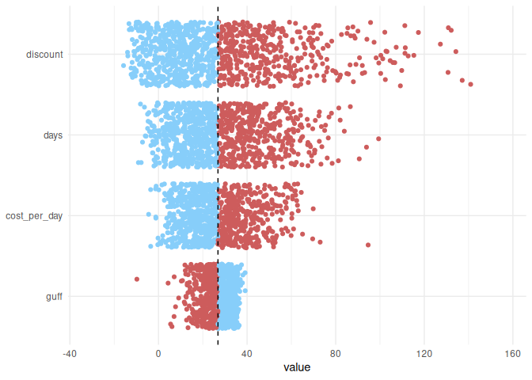
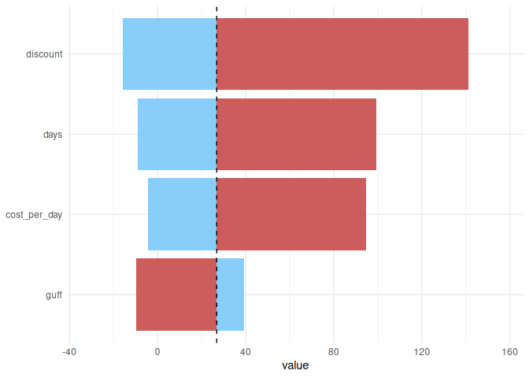

<!-- README.md is generated from README.Rmd. Please edit that file -->

# tp

**Experimental, demo package**

Small wrapper package, primarily to demonstrate creation of tornado
plots.

## Installation

You can install the development version of tp from R-Universe via:

``` r
install.packages('tp', repos = c('https://timtaylor.r-universe.dev', 'https://cloud.r-project.org'))
```

## How to use

tp provides two main functions: `tornado_samples()` and
`tornado_plot()`.

The first of these, `tornado_samples()` takes:

- A user-supplied, vectorised, input function;
- A set of distributions you wish to draw from that have a one-to-one
  matching to the aforementioned function’s parameters. These must be
  from the
  [distributions3](https://alexpghayes.github.io/distributions3/)
  package.
- A number of samples to draw for each parameter.

The function is just a small wrapper around lapply that loops over a
functions parameters, sampling one whilst fixing the others. In effect
it just wraps a simple univariate sensitivity analysis, ensuring the
output is formatted in a usable way for the later plot function. The
output is a tibble with class **tornado_samples** and an additional
attributes that gives the baseline value calculated when setting each
argument to it’s distributions mean value.

``` r
library(tp)
set.seed(1)

# Function with desired arguments
# NOTE: MUST be vectorised by the user and return a scalar value
fun <- function(cost_per_day, days, discount) cost_per_day * days * discount

# A distribution (from distributions3) for each function argument
distributions <- list(
    cost_per_day = distributions3::Gamma(shape = 9, rate = 0.5),
    days         = distributions3::Gamma(shape = 5, rate = 1),
    discount     = distributions3::Beta(alpha = 2, beta = 40)
)

# Number of samples to take for each argument
samples <- 1000

# generate the samples for each parameter
(dat <- tornado_sample(samples, fun, distributions))
#> $cost_per_day
#> # A tibble: 1,000 × 4
#>    cost_per_day  days discount .result
#>           <dbl> <dbl>    <dbl>   <dbl>
#>  1        13.5      5   0.0476    3.22
#>  2        25.6      5   0.0476    6.10
#>  3        25.2      5   0.0476    6.01
#>  4        19.5      5   0.0476    4.64
#>  5         9.21     5   0.0476    2.19
#>  6        20.0      5   0.0476    4.75
#>  7        21.6      5   0.0476    5.14
#>  8        20.5      5   0.0476    4.89
#>  9        15.3      5   0.0476    3.63
#> 10        12.7      5   0.0476    3.01
#> # ℹ 990 more rows
#> 
#> $days
#> # A tibble: 1,000 × 4
#>    cost_per_day  days discount .result
#>           <dbl> <dbl>    <dbl>   <dbl>
#>  1           18  7.73   0.0476    6.62
#>  2           18  2.69   0.0476    2.31
#>  3           18  4.65   0.0476    3.99
#>  4           18  2.56   0.0476    2.20
#>  5           18  2.76   0.0476    2.36
#>  6           18  2.19   0.0476    1.87
#>  7           18  5.84   0.0476    5.01
#>  8           18  3.45   0.0476    2.96
#>  9           18  8.31   0.0476    7.12
#> 10           18  4.47   0.0476    3.83
#> # ℹ 990 more rows
#> 
#> $discount
#> # A tibble: 1,000 × 4
#>    cost_per_day  days discount .result
#>           <dbl> <dbl>    <dbl>   <dbl>
#>  1           18     5   0.0493   4.43 
#>  2           18     5   0.0541   4.87 
#>  3           18     5   0.0434   3.90 
#>  4           18     5   0.0177   1.60 
#>  5           18     5   0.0109   0.977
#>  6           18     5   0.0551   4.96 
#>  7           18     5   0.0179   1.61 
#>  8           18     5   0.0711   6.40 
#>  9           18     5   0.0840   7.56 
#> 10           18     5   0.0531   4.77 
#> # ℹ 990 more rows
#> 
#> attr(,"baseline")
#> [1] 4.285714
#> attr(,"class")
#> [1] "tornado_samples"
```

`tornado_plot()` takes, as input, the output from `tornado_sample()` as
well as a character string specifying the type of tornado plot to create
(**jitter** or **maxmin**). The first of these simply plots the sample
results against the corresponding distribution that varies. The second
options plots the corresponding maximum and minimum values as a split
bar chart.

``` r
tornado_plot(dat)
```

<!-- -->

``` r
tornado_plot(dat, type = "maxmin")
```

<!-- -->
